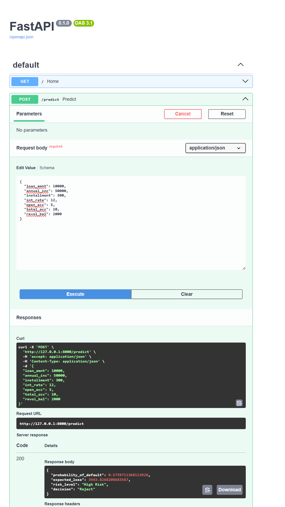
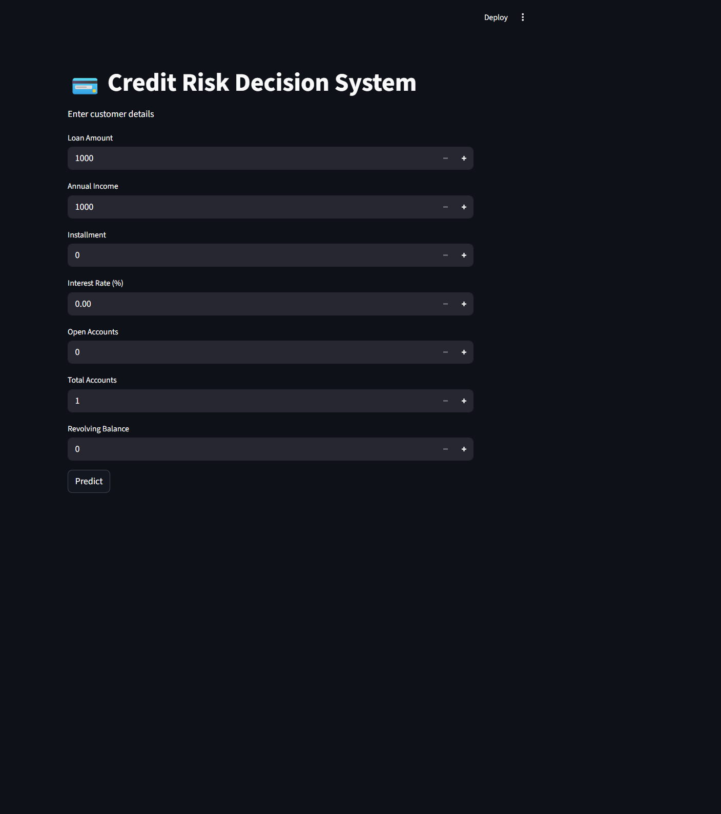
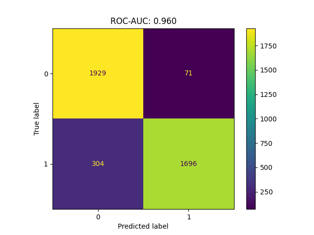
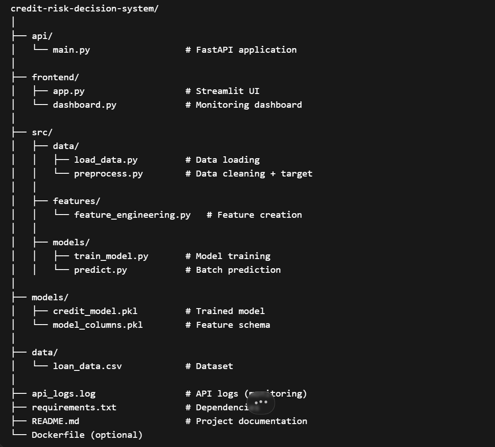

# 💳 Credit Risk Decision Engine (Production-Ready FinTech System)

🚀 Built a **production-grade credit risk system** that goes beyond ML prediction to **business decisioning**, combining Probability of Default (PD), Expected Loss (EL), and risk segmentation.

---

## 🧠 Business Impact

Traditional ML projects stop at prediction.
This system translates model outputs into **real lending decisions**:

* Reduce **default risk exposure**
* Optimize **approval strategy**
* Align predictions with **financial impact (Expected Loss)**

---

## ⚡ Key Capabilities

### 🔹 1. Risk Prediction (PD Modeling)

* Binary classification for default prediction
* ROC-AUC ≈ **0.96**
* Leakage-free training pipeline

---

### 🔹 2. Financial Decision Layer (Core Differentiator)

Implements real fintech logic:

> **Expected Loss = PD × Loan Amount × LGD**

* LGD assumed = 60%
* Enables **monetary risk estimation**, not just classification

---

### 🔹 3. Dual Decision Engine (Industry-Level)

```python
if prob > 0.4:
    decision = "Reject"
elif expected_loss > 2000:
    decision = "Reject"
else:
    decision = "Approve"
```

👉 Combines:

* **Risk likelihood (PD)**
* **Financial exposure (EL)**

---

### 🔹 4. Risk Segmentation

| PD Range  | Segment     |
| --------- | ----------- |
| < 0.05    | Low Risk    |
| 0.05–0.15 | Medium Risk |
| > 0.15    | High Risk   |

---

### 🔹 5. Real-Time Decision API

* FastAPI-based inference layer
* Handles:

  * Input validation
  * Feature engineering
  * Prediction
  * Decision logic

---

### 🔹 6. Interactive Frontend (Product Thinking)

* Streamlit UI for real-time scoring
* Simulates **loan underwriting flow**

---

### 🔹 7. Monitoring Dashboard (Advanced)

* Batch scoring
* Risk distribution analysis
* Decision analytics

---

## 📸 System Demonstration

### 🔹 API (Real-Time Decision Engine)



---

### 🔹 User Interface (Loan Simulation)



---

### 🔹 Model Performance



---

### 🔹 Project Architecture



---

## 📊 Model Performance

* ROC-AUC: **0.96**
* Balanced precision/recall
* Robust against data leakage

---

## 🏗️ System Architecture

End-to-end pipeline:

```
Data → Preprocessing → Feature Engineering → Model → API → Decision Engine → UI
```

---

## ⚙️ Tech Stack

* **Python, Pandas, NumPy**
* **Scikit-learn (ML)**
* **FastAPI + Uvicorn (Deployment)**
* **Streamlit (Frontend & Dashboard)**

---

## ▶️ Quick Start

```bash
# Install dependencies
pip install -r requirements.txt

# Train model
python src/models/train_model.py

# Start API
uvicorn api.main:app --reload

# Run UI
streamlit run frontend/app.py
```

---

## 🔥 What Makes This Project Top 1%

✔ Goes beyond ML → **business decision system**
✔ Implements **Expected Loss (fintech standard)**
✔ Includes **real-time API + UI**
✔ Demonstrates **production thinking (logging, modular design)**
✔ Shows **end-to-end ownership (data → deployment)**

---

## 🎯 Key Learnings

* Handling **data leakage in credit risk**
* Aligning ML with **business KPIs**
* Designing **production inference pipelines**
* Translating models into **financial decisions**

---

## 👨‍💻 Author

**Tonumay Bhattacharya**
Aspiring Data Scientist | AI/ML | FinTech

---

⭐ Star this repo if you found it valuable!
